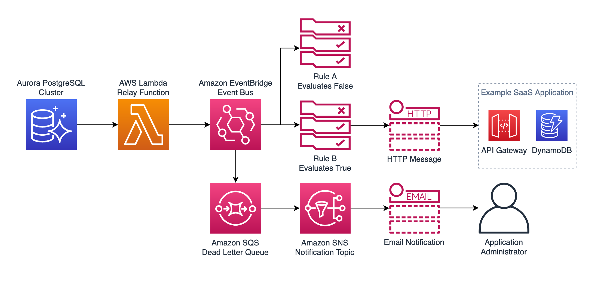

# Amazon Aurora & Amazon EventBridge Webhooks Sample

This AWS Cloud Development Kit (CDK) application provides an example architecture of emitting external webhooks using Amazon EventBridge.

In this example, the events are sourced directly from Amazon Aurora using the built in Lambda extension for PostgreSQL.

## Architecture

## Prerequisites

Install the CDK toolkit: https://docs.aws.amazon.com/cdk/latest/guide/getting_started.html#getting_started_install

## Getting Started

- Deploy the application using AWS CDK: `cd cdk && cdk deploy`
- Connect to the provisioned AWS Cloud9 development instance
- Install the postgres client tools: `sudo yum install postgresql`
- Connect to the Aurora cluster using psql: `psql -h <AURORA_WRITER_ENDPOINT> -U dbadmin -d postgres -p 5432`. To get the DB password, check AWS Secrets Manager for the password generated by the CDK template.
- Deploy the schema file contained in /db (be sure to update the `toEventBridge` function ARN to match the one created by the CDK deployment)
- Insert some sample widgets and see that the data is propagated to Amazon DynamoDB: `call create_widget(1, 'fooWidget');`
- Now navigate to Amazon DynamoDB in the console, check the items in the WebhooksStack table created by the CDK template and see that the widget has been propagated to the mock SaaS application using Amazon EventBridge
